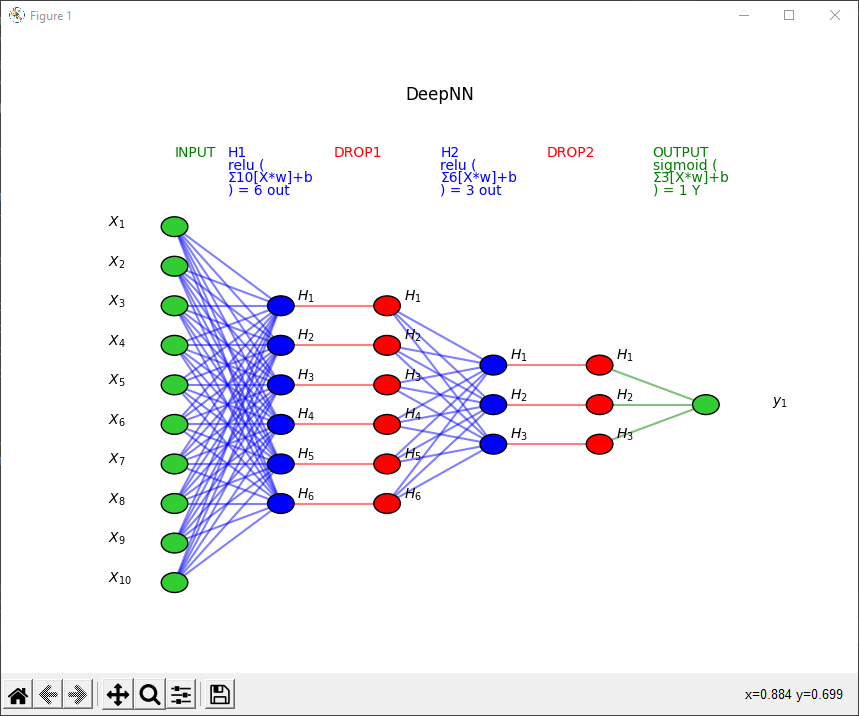
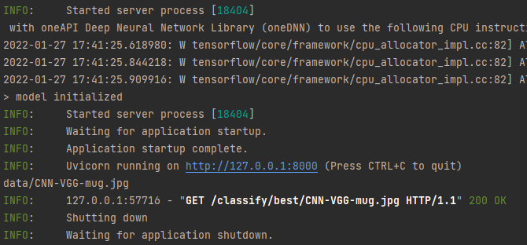
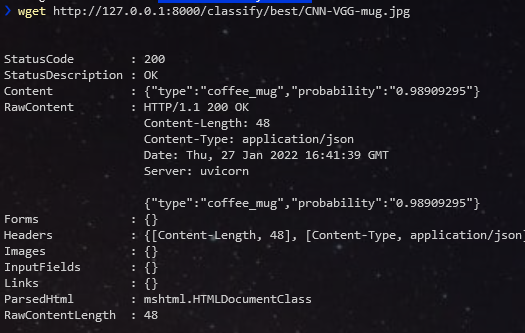
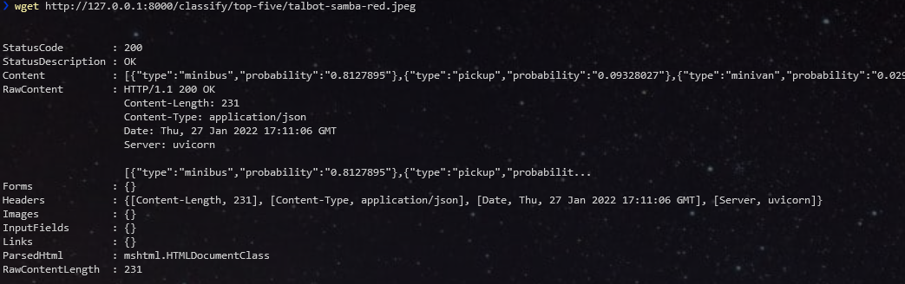

# Tensorflow Keras deep learning samples

Python library and PyCharm project that includes deep learning samples and neural networks visualization tools:

- single fully connected layer
- deep neural network with perceptron
- image classification with VGG16
- neural network model visualization
- Web Api that serves application features

## Screenshots

### a deep NN view

### image prediction with WebAPI and VGG16

#### starting the server Uvicorn

#### querying for a prediction giving a mug picture

gives a very good result: probability to be a coffee mug > 98%

#### querying for a prediction giving a car picture "talbot samba"

is very less accurate: probability to be a 'minibus' > 81% ;)

## Dependencies

- python 3.9.9
- tensorflow 2.7.0
- keras 2.7.0
- matplotlib 3.5.1
- shap 0.40.0
- pydot 1.4.2
- graphviz
- fastapi 0.72.0
- uvicorn[standard] 0.17
